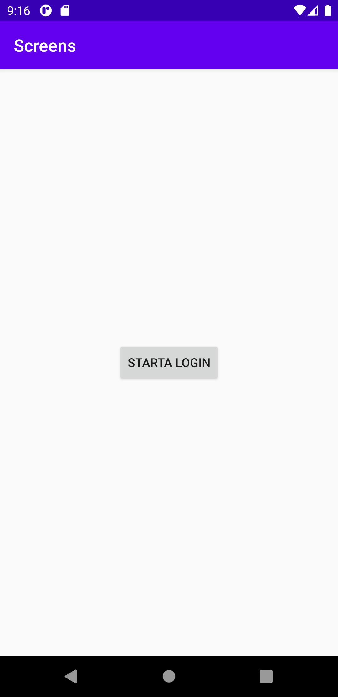
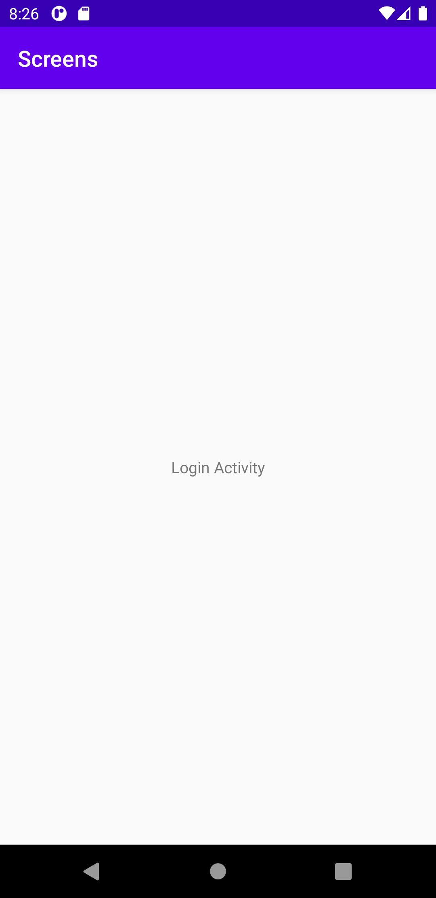
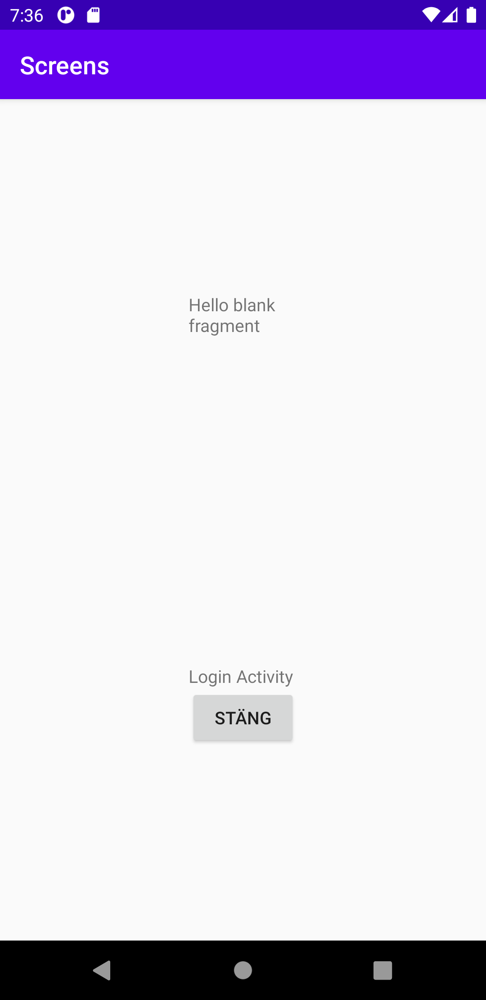

# Rapport

Började med att skapa en till aktivitet som döptes till Login. Jag ville att MainActivity skulle vara första sidan och att LoginActivity skulle vara den andra
sidan i appen. Med hjälp av koden som visas här nedanför var detta möjligt. Ifall jag hade bytt plats på MainActivity och LoginActivity så hade LoginActivity blivit
startsidan för appen.

```
<activity android:name=".MainActivity">
            <intent-filter>
                <action android:name="android.intent.action.MAIN" />

                <category android:name="android.intent.category.LAUNCHER" />
            </intent-filter>
        </activity>
        <activity android:name=".LoginActivity">
        </activity>
```

För att komma till Login sidan skapades en knapp och knappen skapades i activity_main och fick ett ID för att göra knappen unik (se bild 1). För att det ska gå att kunna
klicka på knappen så används bland annat koden som visas här nedanför. Jag skapar ett intent för att säga vilken av de båda aktiviteterna jag vill starta, och eftersom
jag satte class efter LoginActivity så betyder det att det är LoginActivity som jag vill starta, resultatet som blir när man klickar på knappen blir som bild 2 visar.
```
button.setOnClickListener(new View.OnClickListener() {
```
```
Intent intent = new Intent(MainActivity.this, LoginActivity.class);
```




Väl inne på Login sidan i appen så skapades en till knapp på den sidan som skulle göra det möjligt att stänga den sidan. I activity_login skapades en Linearlayout
innehållande den nya knappen. Knappen fick bland annat ett ID och ett namn. För att knappen ska fungera så behövdes koden som visas här nedanför, men till skillnad
från den förra knappen som skulle starta aktiviteten så skulle denna knapp stänga.
```
Button close = findViewById(R.id.close);
        close.setOnClickListener(new View.OnClickListener() {
            @Override
            public void onClick(View v) {
                Log.d("TAG", "Stänger aktivitet");
                finish();
            }
        });
```

Det skapades ett fragment och det lades in i activity_login i Linearlayout för att jag ville att fragmentet skulle hamna ovanför knappen. Ett namn på fragmentet
skulle jag ha och namnet skulle stämma överens med Java filen. Resultatet av det var koden som visas här nedanför samt bild 3.

```
<fragment
            android:name="com.example.screens.BlankFragment"
```


